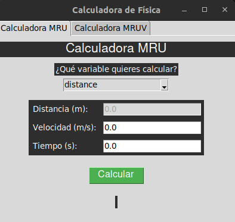
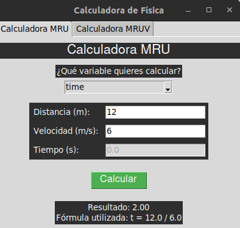
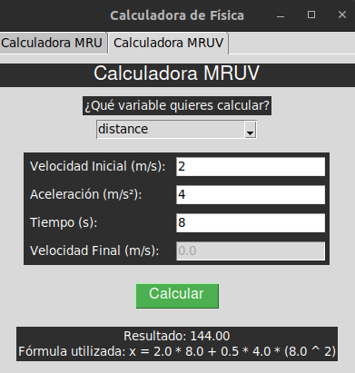
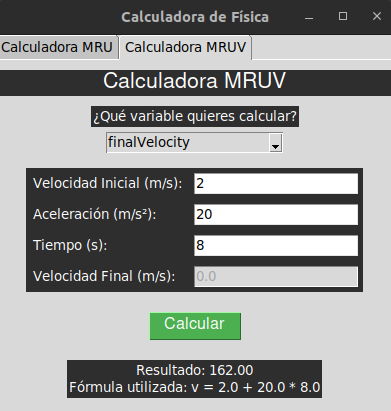

# Calculadora MRU y MRUV en Python

Este repositorio contiene una herramienta desarrollada en Python para calcular parámetros del Movimiento Rectilíneo Uniforme (MRU) y el Movimiento Rectilíneo Uniformemente Variado (MRUV). La aplicación utiliza la biblioteca Tkinter para proporcionar una interfaz gráfica que permite a los usuarios realizar cálculos de manera interactiva.

## Características

- Interfaz gráfica intuitiva.
- Cálculo de distancia, velocidad, tiempo y aceleración para MRU y MRUV.
- Resultados precisos y fáciles de interpretar.

## Instalación

Para utilizar esta aplicación, asegúrate de tener Python instalado en tu sistema. Si no tienes Tkinter instalado, puedes instalarlo usando el siguiente comando:

```bash
pip install tk
```

### Clonación del Repositorio

Puedes clonar este repositorio utilizando el siguiente comando:

```bash
git clone https://github.com/LeonDavisCoropuna/calculator-mru-mruv-python-tkinter.git
```

### Ejecución de la Aplicación

Navega al directorio del proyecto y ejecuta el siguiente comando:

```bash
python main.py
```

## Capturas de Pantalla

### Pantalla Principal



### Ejemplo de Cálculo MRU



### Ejemplo de Cálculo MRUV



### Ejemplo 2 de Cálculo MRUV
